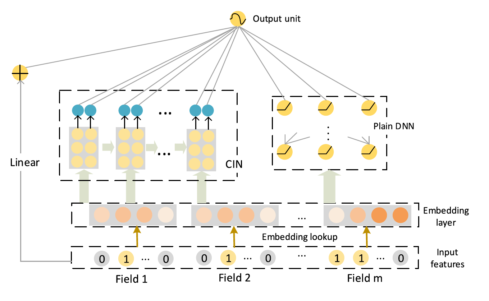
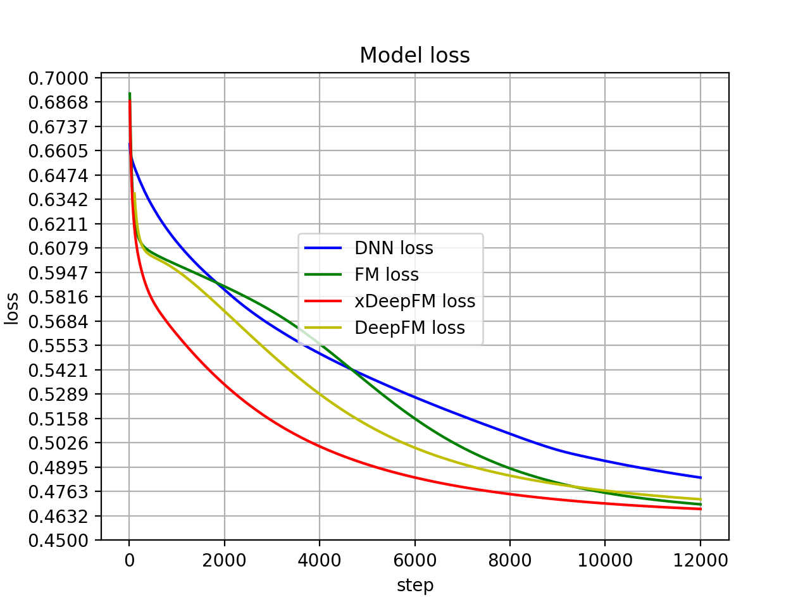

# xDeepFM

## 介绍

**- 原论文题目：《xDeepFM: Combining Explicit and Implicit Feature Interactions for Recommender Systems》**
**- 原论文地址： [xDeepFM](https://arxiv.org/pdf/1803.05170.pdf.)**

**- 论文整理: []()**

下面对本论文提出的模型进行了复现。

## 模型介绍

**- 模型架构 = FM + CIN + DNN **



## 使用

**1.数据准备**

+ 训练集和测试集需为.csv文件
+ 支持**数值型特征映射为embedding**,也支持**数值型特征直接作为DNN输入**
+ 支持**多值离散特征**的处理,可自行配置为sum or mean,分隔符请用"|"
+ **cat特征**需要自行先用labelEncoder转换一下

具体配置在**Config.py**文件中，也可结合ex_data中的例子作为参考。

**转换完成后的训练数据示例:**

```
1,18:1,30:1,0:0.25,2:0.8125,4:0.0,6:0.0,8:0.0,10:0.006630292147247738,12:0.8125,14:0.25,16:0.5625,
```

**2.模型训练**

+ 先在Config中指定单值离散，多值离散，连续型特征
+ 默认激活函数"relu",默认optimizer"Adagrad"
+ 默认DNN网络结构 [128,64,32]
+ 默认CIN卷积核维度 [10,10,10] ,输出维度 [1]
+ 默认使用 DNN + CIN + FM，可在Config中配置
+ 默认建立vocabulary的最低词频 10

**3.模型试验**

**- Batch_size : 4096 , epochs: 2000**

**- 指标为"logloss"**  



## 小结

模型基于DeepFM加入了**CIN component (压缩交互网络)**，对原有的结构进行了vector-wise和边界明确的交互填充

+ **优点**：表达能力更强，可以发掘出vector-wise的交互特征，精度更高
+ **缺点**：训练速度变得很缓慢


