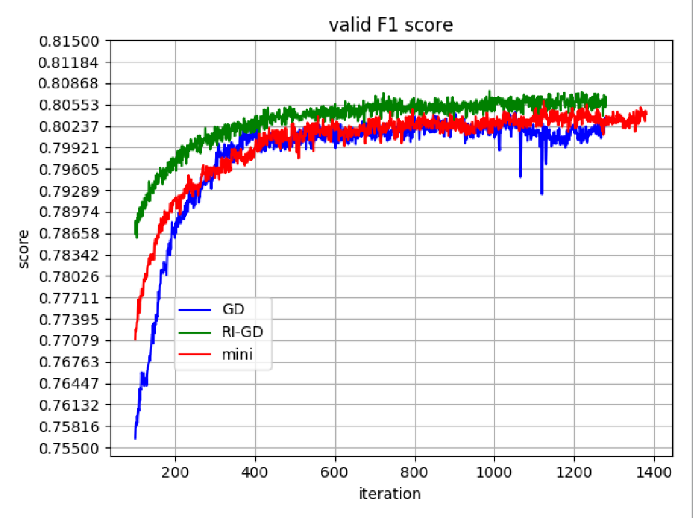

# RI-DeepFM
Recurrent improve Deep-FM , Deep-FM 改进版 , 本文主要基于陈成龙的DeepFM模型做为基础添加部分修改(原DeepFM地址)：

[chenglong chen's github: https://github.com/ChenglongChen/tensorflow-DeepFM](https://github.com/ChenglongChen/tensorflow-DeepFM)

## **主要改动:**

- [x] 新增**分段循环训练**，每段训练可以**自定义损失函数，learning_rate,batch_size,epochs**,所有段训练完成为一个recurrent,可以训练多个recurrent。

- [ ] **可以处理多值离散特征**，例如下表中的'爱好'特征。

  | 爱好               | 年龄 | 性别 |
  | :----------------- | :--- | :--- |
  | 玩游戏\|踢球\|游泳 | 20   | 1    |
  | 玩游戏             | 18   | 0    |
  | 跑步\|踢球         | 34   | 1    |

- [ ] **可以自动处理缺失值**

## 模型架构

TODO

## 实践

**1.GD mini-batch RI-GD 实验**

