# XDeepFM: Combining Explicit and Implicit Feature Interactions for Recommender Systems

# ABSTRACT

1.现在诸如DeepFM和Deep&Wide等模型都可以自动学习隐式的高维交互特征，并结合了低维特征，**但是有一个缺点就是它们的高维特征都是在bite-wise的层面上进行交互的**。本片论文提出了一种**压缩交互网络(Compressed Interaction Network(CIN))**，能够学习显式的交互特征并且是在vector-wise的级别，CIN带有一些CNN和RNN的特点，最终作者将整个模型命名为"eXtreme Deep Factorization Machine(xDeepFM)"。

2.本文提出的模型有两个优点：

+ 能够显式的学习有明确边界的高维交互特征
+ 能够学习隐式的低维和高维特征

个人理解这里作者对implicit和explicit的理解是交互特征的维度是否明确，在这里翻译为隐式和显式。

## INTRODUCTION

1.简单介绍了单值离散特征和多值离散特征，然后介绍三个**手动提取交互特征的缺点：**

+ 挖掘出高质量的交互特征需要非常专业的领域知识并且需要做大量的尝试，很耗时间。
+ 在大型的推荐系统中，原生特征是海量的，手动挖掘交叉特征几乎不可能。
+ 挖掘不出肉眼不可见的交叉特征

2.然后介绍了**经典的FM模型**，用提取隐向量然后做内积的形式来提取交叉特征，扩展的FM模型可以提取随机的高维特征，但是**主要的缺陷是：**

+ 会学习所有的交叉特征，其中肯定会包含无用的交叉组合，另外一篇论文指出引入无用的交叉特征会引入噪音并降低模型的表现。

3.介绍了引入了DNN的组合模型，"Factorisation-machine supported Neural Network **(FNN)**"，它在DNN之前使用了预训练的field embedding。

4.介绍了**PNN**(Product-based Neural Network),在embedding layer和DNN Input之间插入了一层product layer,不依赖于pre-trained FM。

5.FNN和PNN的缺点都是忽略了低维交互特征，**Wide&Deep和DeepFM**模型通过混合架构解决了这种问题，但是它们同样存在缺点：

+ 它们学习到的高维特征是一种implicit fasion,没有一种公式可以明确推论出最终学习出来的交叉特征到底是多少维的
+ 另一方面，其DNN部分是在bit-wise的层面下进行学习的，而经典的FM架构是在vetor-wise层面学习的

6.本文提出的方法基于**DCN(Deep & Cross Network)**模型，其目标是有效率的捕捉到**边界明确的交叉特征**。

# PRELEMINARIES

## Embedding Layer

介绍一些基于"univalent","multivalent"进行embedding的基础知识，这里不介绍了:

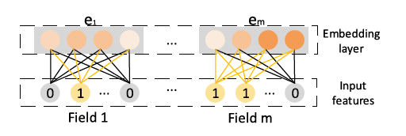

## Implicit High-order Interactions

前向传播过程：

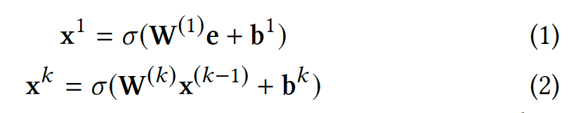

这种架构是bit-wise层面的，意思是说，**即使是同一个filed embedding，不同的element之间也会互相影响。**

PNN和DeepFM基于上面的缺点进行了改进，除了DNN component,**还添加了two-way interation layer到架构中，这样就既有vector-wise也有bit-wise的component了**。PNN和DeepFM的区别就是DeepFM是把product layer直接作为结果连到输出层，**而PNN是把product layer放在DNN和embedding layer之间**

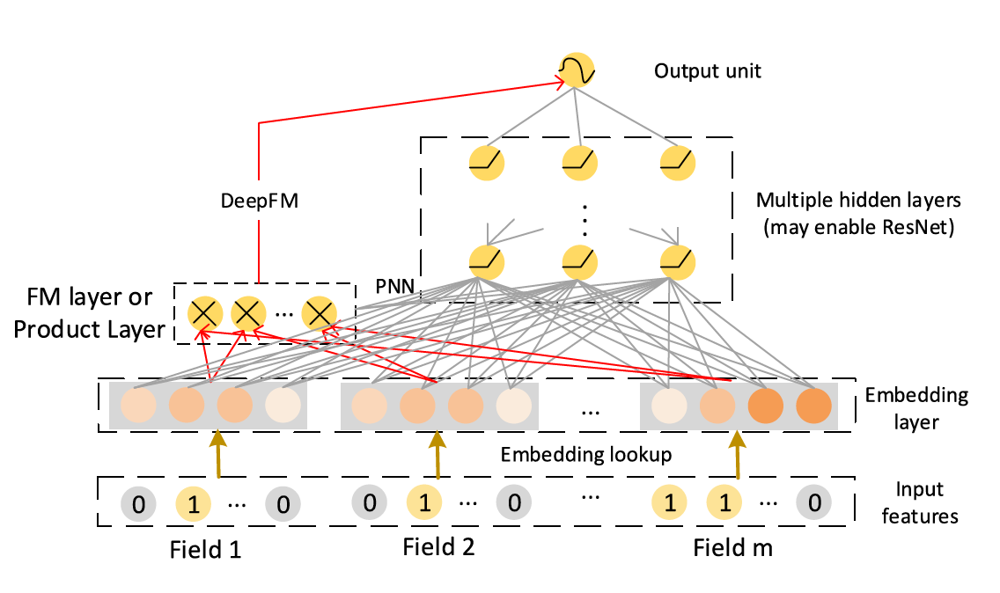

## Explicit High-order Interactions

这里主要介绍了Cross Network(cross net)也是本文主要借鉴的一种模型，下面是该模型的架构：

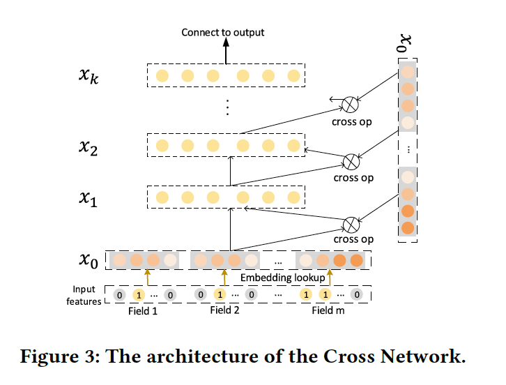

该模型的主要目标是显示的构建高维交互特征，不像DNN前向传播的全连接层那样，每个隐藏层是通过如下公式计算出来的：

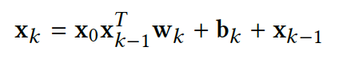

通过推导可以看出其实**每一个隐含层都是x0的一个scalar multiple,**这当然不是代表隐含层是x0的线性表达，只是说因为每一层原生x0都会参与计算，因此对x0非常敏感。**但是其缺点为：**

+ crossnet的输出是一种特殊形式，即x0的scalar multiple
+ 交互特征仍然是bit-wise层面的

# OUR PROPSED MODEL

## Compressed Interation Network

本论文设计了一种新的cross network, 称为**Compressed Interaction Network (CIN)**, 设计的时候主要**考虑了下面三个方面：**

+ 交互特征是在vector-wise层面的(主要基于crossnet改进了这点)
+ 高维交互特征是显式的
+ 网络的复杂度不会因为交互层级的增加而增加

**下面介绍了一些在CIN的中的概念：**

既然在CIN中是vector-wise层级的，那么每一个unit是一个vector，因此field embedding的输出是一个mxD的矩阵(D:embedding size,m:filed size)，CIN的第k层是一个Hk x D的矩阵(Hk代表的是CIN中每一层的向量数量，H0=m),**下面是第CIN第k层的h-emb的计算公式：**

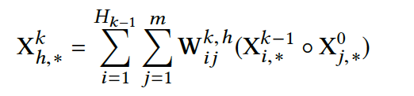

还是比较直观的，其中○代表Hadamard product:

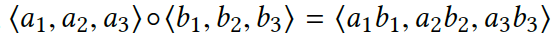

**可以发现k-th layer的计算也是和crossnet一样依赖于(k-1)-th layer和 0-th layer,因此交互特征是显式的，而且交互的层级随着网络结构的加深而增加(在这点上和crossnet是一样的)，同时通过公式也可以很明显的看出，模型是vector-wise的:**

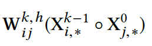

如果公式不好理解的话，可以通过如下图示来理解：

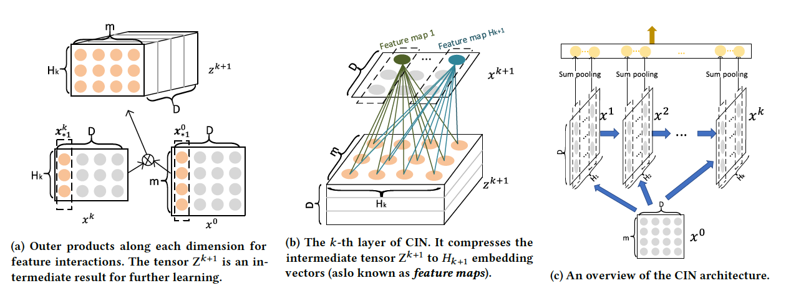

图(a)和(b)表示了如何从这一层的隐藏层（Hk x D）和X^0层（m X D）来产生下一层隐藏层的（Hk+1 x D）,图示所示计算方法是为了更好的展现为什么模型有CNN的思想，先通过X0和Xk的第i列做一个outer product(matrix multiplication)得到一个Hk x m的矩阵(0<=i<D), 然后W就像是CNN中的filter,来过滤产生每个feature map的第i列，这样CNN中的"compressed"在CIN中就指代 Hk x D矩阵压缩为Hk+1 x D矩阵。

需要注意的是，**CIN的输出是除了X0以外每一层的feature map的sum pooling横向拼接的结果。**然后根据所需要进行的任务套一个激活函数就行了，比如sigmoid:

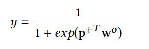

## CIN Analysis

本文从空间复杂度，时间复杂度和多项式逼近等方面进行了分析，这里只介绍参数：

从公式也可以看出:

计算第k-th layer的第h(0<h<=Hk)个emb需要(Hk-1 x m)个参数，而k-th layer共有Hk个emb vetor，因此**计算k-th layer在第k-1 th需要(Hk x Hk-1 x m)个参数** 。

## Combination with Implicit Networks

由于DeepFM可以对低维交叉特征和隐式的高维交叉特征有一个比较好的支持了，因此直接将CIN加入到DeepFM中以补足其缺少有明确边界的vetor-wise层级的部分，最终的公式如下：

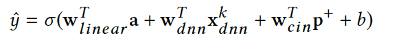

最终的模型结构如下：

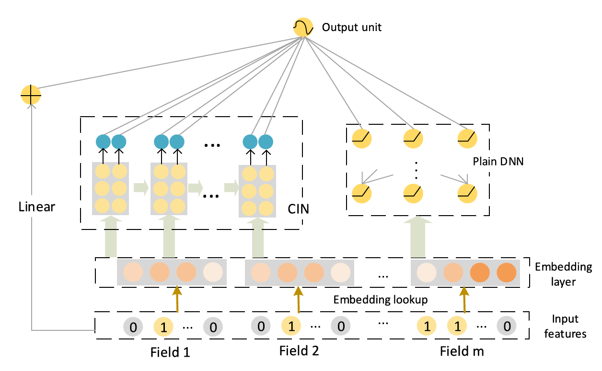

# EXPRIMENTS

这部分就不说了，反正就是好多实验，自己的模型就是吊吊吊，有用的信息是：

+ 对于这种高维稀疏特征来说，基于FM思想的模型例如DeepFM,Deep&Wide,PNN等比LR不知道高到哪里去了
+ 并不是混合模型就一定好，但是单用DNN component一般效果比较差
+ 这种用于高维稀疏特征的混合模型一般在比较浅层的比如2-3层的网络结构下会取得最好的效果

